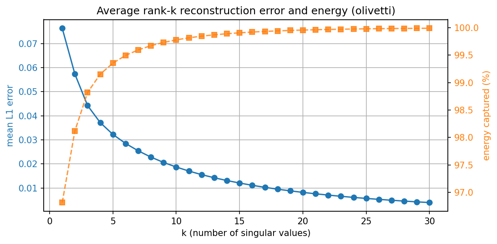
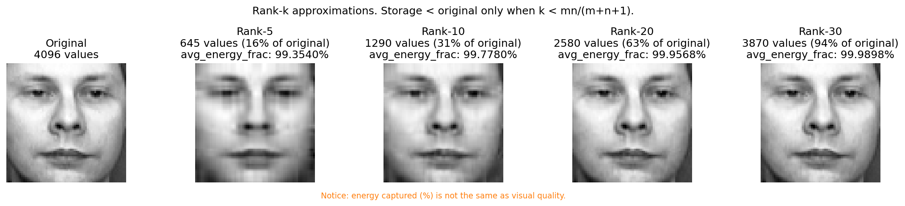
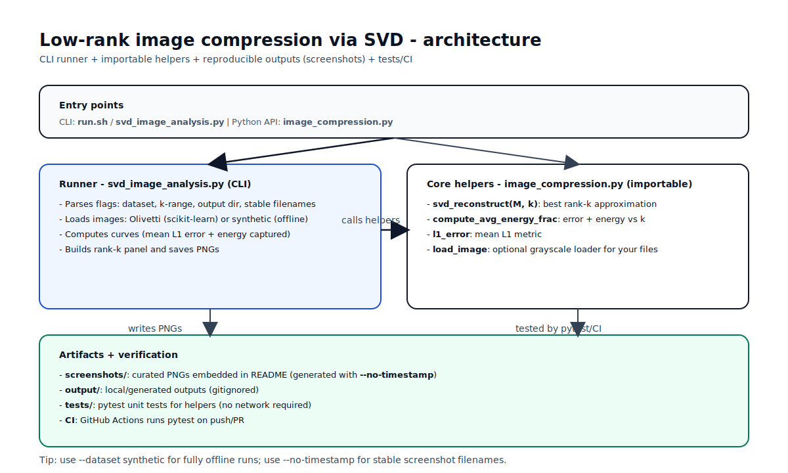

# Low-rank image compression via SVD

This repo demonstrates **low-rank image compression** using **Singular Value Decomposition (SVD)**.

It visualizes the tradeoff between:
- **reconstruction error** (mean L1 per pixel), and
- **energy captured** (fraction of \(\|M\|_F^2\) explained by the top-\(k\) singular values),
as you vary the rank \(k\).

It also produces a **rank-\(k\) panel** showing how visual quality changes as you keep more singular values.

## Example outputs





## Quickstart

Requirements: **Python 3.12+**

```bash
bash run.sh
```

This runs **fully offline** (synthetic dataset) and writes PNGs to `output/`.

## Install (manual)

```bash
python3 -m venv .venv
source .venv/bin/activate
python -m pip install --upgrade pip
python -m pip install -r requirements.txt
```

## Run

### Default (Olivetti faces)

```bash
python svd_image_analysis.py --output-dir output
```

Notes:
- `--dataset olivetti` is the default and **may download the dataset** on first run.
- Output filenames include a timestamp unless you pass `--no-timestamp`.

### Fully offline (synthetic)

```bash
python svd_image_analysis.py --dataset synthetic --output-dir output --no-timestamp
```

### Generate stable screenshots for the README

```bash
python svd_image_analysis.py --dataset olivetti --output-dir screenshots --no-timestamp
```

## Importable API

```python
from image_compression import load_image, svd_reconstruct, l1_error

img = load_image("photo.jpg")
reconstructed = svd_reconstruct(img, k=50)
print("L1 error:", l1_error(img, reconstructed))
```

## Architecture diagram



## Notes on storage

For an \(m \times n\) image:
- Full storage is \(mn\) values.
- A rank-\(k\) SVD approximation stores about \(k(m+n+1)\) values.

## Energy captured vs visual quality

“Energy captured” (percentage of \(\|M\|_F^2\)) is a useful summary statistic, but it does **not** perfectly track perceptual quality. That’s why the repo includes both the curves **and** a rank-\(k\) visual panel.

## Project structure

```
.
├─ image_compression.py      # importable helpers
├─ svd_image_analysis.py     # CLI runner (writes PNGs)
├─ requirements.txt
├─ tests/
├─ screenshots/              # curated images embedded in README
└─ output/                   # local/generated outputs (gitignored)
```

## License

MIT. See `LICENSE`.
